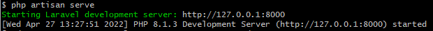

# Learn Laravel

## Create project

1. Create a Laravel project
    ```shell
    composer create-project laravel/laravel –-prefer-dist
    ```
2. Start web service
    ```shell
    php artisan serve
    ```
    
3. Now we can access to the web application via http://localhost:8000/
    

Reference: https://www.tutorialspoint.com/laravel/laravel_installation.htm
