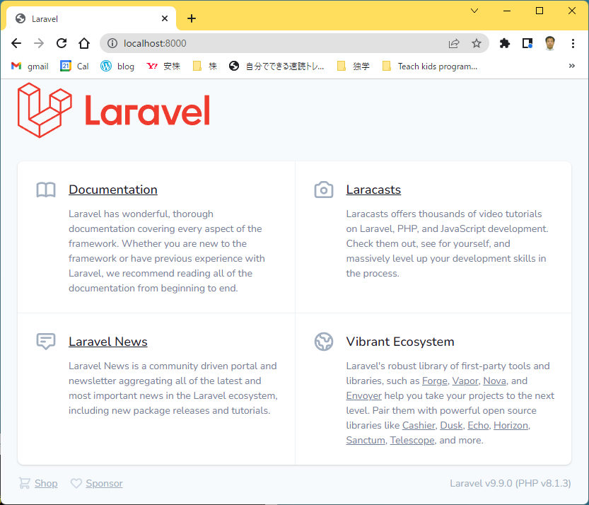

# Learn Laravel

## Create project

1. Create a Laravel project
    ```shell
    composer create-project laravel/laravel –-prefer-dist
    ```
2. Start web service
    ```shell
    php artisan serve
    ```
    
3. Now we can access to the web application via http://localhost:8000/
    

Reference: https://www.tutorialspoint.com/laravel/laravel_installation.htm

## Configuration

* We set configuration (such as database connection, mail server etc) in the file .env. This values is load into config files in the *config* folder.
* The file *.env* is individual for each environment (product, development, dev PCs...) and is not commit to git for security reason.
* The file *.env* is generated from *.env.example*, so *.env.example* should contains all available variables may be declared in *.env*.
* We use env-helper function *env()* to retrieve variable from the file *.env* in config files. But in another file (programing code files), don't use env(), use config() function to get all configurations.

## Routing

* Defined in *routes/web.php*
* There are two types of middleware
    * Global Middleware
    * Route Middleware
* Basic: return view().
* Required parameter and optional parameter.
* Named routes: chưa hiểu.

Reference: https://www.tutorialspoint.com/laravel/laravel_routing.htm

## Middleware

* Create middleware and registered in Kernel.php
    ```shell
    php artisan make:middleware <MiddleWareName>
    ```
    * Middleware handle() run before controller.
    * Middleware terminate() run after controller.

## Controller

* Creating a controller
    ```shell
    php artisan make:controller <controller name>
    ````
* Controller middleware: Attach middleware in Route or in controller's __construct()
* Restful resource controller: Use Route::resource()
    ```php
    Route::resource($path, $controllerClass);     
    ```
* Implicit controller: Use Route::controller()
    ```php
    Route::controller($baseUri, $controllerClass);
    ```
* Constructor injection: *TODO: CHƯA HIỂU*

### Request

## Other tool

### Maintenance mode

To set into maintenance mode
```shell
    php artisan down
```

To disable maintenance mode
```shell
    php artisan up
```

# Preferences

* [riptutorial](https://riptutorial.com/Download/laravel.pdf)